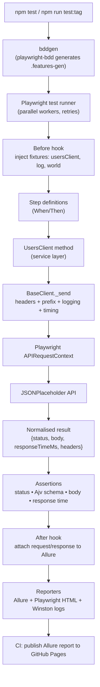

# Architecture

This document explains how the framework is structured, how a test flows end-to-end,
which APIs are exercised, and the rationale behind the key design decisions.

---

## 1. Design goals

| Goal | How it is met |
|------|---------------|
| Readable, business-facing tests | Gherkin `.feature` files (BDD) |
| Native speed, parallelism, retries | `playwright-bdd` compiles Gherkin → Playwright tests |
| No duplicated request code | **Service/Client layer** (Base + per-resource clients) |
| Contract safety | **Ajv** JSON-Schema validation |
| Externalised, reusable data | **DataManager** reading `/data` fixtures |
| Debuggable runs | **Winston** logs + Allure request/response attachments |
| Environment portability | `config/env.js` + `.env` |
| Reliable, repeatable CI | GitHub Actions + Allure on GitHub Pages |

---

## 2. Layered structure

```
features/   →  WHAT to test     (Gherkin, business language, tags)
steps/      →  glue             (maps Gherkin sentences to actions/assertions)
hooks/      →  fixtures + lifecycle (inject clients, logger, world; Before/After)
clients/    →  HOW to call API  (BaseClient + UsersClient service layer)
utils/      →  cross-cutting    (logger, dataManager, schemaValidator)
data/       →  test data        (JSON objects, strings, arrays; per-env)
schemas/    →  contracts        (JSON Schema per response)
config/     →  environment      (baseURL, headers, timeouts, log level)
```

Each layer has a single responsibility and depends only on the layer(s) below it.
Adding a new endpoint = add a client method + a feature + steps; nothing else changes.

---

## 3. Execution flow



### Walkthrough of one scenario

`features/get_users.feature` → *"Fetch a single existing user"*:

1. **bddgen** turns the Gherkin into a Playwright spec under `.features-gen/`.
2. The **Before hook** ([`hooks/hooks.js`](hooks/hooks.js)) logs the start; fixtures
   ([`hooks/fixtures.js`](hooks/fixtures.js)) provide a `usersClient`, a scenario-tagged
   `log`, and a `world` scratchpad.
3. The **When step** ([`steps/users.steps.js`](steps/users.steps.js)) calls
   `usersClient.getUser(2)`.
4. **UsersClient** ([`clients/users.client.js`](clients/users.client.js)) delegates to
   **BaseClient** ([`clients/base.client.js`](clients/base.client.js)), which applies shared
   headers + the API prefix, logs the request, times it, fires it via Playwright's
   `APIRequestContext`, then returns a normalised
   `{ status, ok, headers, body, responseTimeMs }`.
5. **Then steps** assert the status (`200`), validate the body against
   `schemas/single-user.schema.json` via **Ajv**, check a field, and assert response time.
6. The **After hook** attaches the request + response JSON to the Allure report and logs the end.
7. **Reporters** emit Allure results, a Playwright HTML report, and rotating Winston logs.

---

## 4. APIs involved

Base URL: `https://jsonplaceholder.typicode.com` (configurable per environment).

| Verb | Endpoint | Purpose | Expected | Schema |
|------|----------|---------|----------|--------|
| GET | `/users/{id}` | fetch single user | `200` + user object | `single-user` |
| GET | `/users` | list users | `200` + array of 10 | `user-list` |
| GET | `/users/23` | non-existent user | `404` | — |
| POST | `/users` | create user | `201` + `{name, job, id}` | `create-user` |
| PUT | `/users/{id}` | update user | `200` + `{name, job, id}` | `update-user` |
| DELETE | `/users/{id}` | delete user | `200` + empty body | — |

> JSONPlaceholder is a **fake** REST API: writes (`POST/PUT/DELETE`) return realistic,
> correctly-shaped responses but are not persisted — ideal for deterministic, side-effect-free
> automation demos.

---

## 5. Key components

### Configuration — `config/env.js`
Resolves the active environment (`TEST_ENV=dev|qa|prod`), exposes `baseURL`, `apiPrefix`,
`timeout`, `logLevel`, and builds `defaultHeaders`. Every value can be overridden by an
environment variable, so secrets/URLs are injectable in CI without code changes.

### Service layer — `clients/`
`BaseClient` is the single choke-point for every HTTP call: shared headers, URL building,
request/response logging, timing, and response normalisation. `UsersClient` extends it with
one method per API operation. Tests never touch raw HTTP.

### Test-data manager — `utils/dataManager.js`
Loads `/data/*.json`, caches it, and resolves a per-environment branch when present.
Supports nested dot-path access and returns objects, strings, or arrays alike — satisfying
the "data can manage JSON object and string/array" requirement.

### Schema validation — `utils/schemaValidator.js`
Compiles a JSON Schema from `/schemas` with Ajv (+ formats) and throws a readable,
aggregated error listing every violation.

### Logging — `utils/logger.js`
Winston with a colourised console transport and a daily-rotating file transport under `/logs`
(uploaded as a CI artifact). Each scenario gets a child logger tagged with its title.

### Fixtures & hooks — `hooks/`
`fixtures.js` extends the playwright-bdd `test` with `usersClient`, `log`, and a per-scenario
`world`. `hooks.js` defines `Before`/`After` (logging + Allure attachments) and
`BeforeAll`/`AfterAll` placeholders for global setup/teardown (e.g. auth token generation).

---

## 6. Failed-test re-run

Configured in [`playwright.config.js`](playwright.config.js): `retries = CI ? 2 : 1`.
Playwright automatically re-runs a failing test up to the retry count. The reporters then
classify each test as **passed**, **flaky** (passed only on retry), or **failed** (never
passed), so transient network blips don't fail the build while genuine regressions still do.

---

## 7. Tag strategy

| Tag | Meaning |
|-----|---------|
| `@smoke` | minimal critical-path checks (one per verb) |
| `@regression` | full suite |
| `@get` `@post` `@put` `@delete` | per-verb selection |
| `@users` | feature/domain grouping |

Tags are filtered at **generation** time: `bddgen --tags "<expr>"` emits only the matching
specs, which Playwright then runs. The CI `workflow_dispatch` `tag` input feeds straight into this.

---

## 8. Why JSONPlaceholder instead of reqres.in?

The original target was reqres.in, but as of 2025 reqres.in requires a **personally
registered `x-api-key`** on every endpoint (the old public `reqres-free-v1` key now returns
`401 missing_api_key`). That breaks "clone and run out of the box" and would force a secret
into CI for a demo. **JSONPlaceholder** needs no authentication, is highly stable, and cleanly
supports all four verbs — so it is the better fit for a self-contained, reproducible framework.
Switching back to an authenticated API is a one-line change in `config/env.js` (set `baseURL`,
`apiPrefix`, and provide `API_KEY`); the header wiring is already in place.
